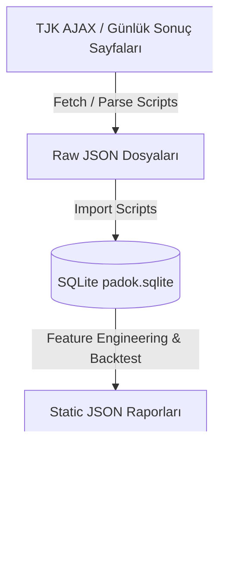

# Padok Yol Haritası ve Geliştirme Önerileri Master Raporu

Bu doküman, Padok projesinin veri çekme (ingestion) boru hattından, SQLite veri modeline, hazır bulunuşluk puanlamasından (readiness model), kullanıcı arayüzü (UI) ve sunum katmanına kadar olan tüm yapısını detaylıca analiz etmekte ve uygulamayı küresel standartlarda bir analitik yarış platformuna dönüştürecek tüm önerileri tek bir kaynakta toplamaktadır.

---

## 1. Mevcut Mimari ve Bileşen Analizi

Padok, sunucusuz (serverless) ve bağımlılıksız (dependency-free) statik bir mimari vizyonuyla kurulmuştur. Veri işleme yükü yerel ortamda koşturulan SQLite veritabanına ve veri dönüştürme scriptlerine yüklenirken; son kullanıcıya sunulan web arayüzü tamamen statik HTML/Vanilla CSS/ESM Javascript ile çalışmaktadır.



### Veri ve Yazılım Katmanları:
1. **Veri Toplama (Ingestion):** `scripts/fetch-tjk-*` scriptleri, TJK AJAX uç noktalarından yarış indeksini ve günlük koşan atların detaylarını çeker. HTML formatındaki veriler `scripts/parse-tjk-*` ile ayrıştırılır.
2. **İlişkisel Veritabanı (SQLite):** `db/schema.sql` şemasına göre oluşturulmuş olan `data/padok.sqlite` veritabanı; atlar (`horses`), jokeyler (`jockeys`), antrenörler (`trainers`), yarışlar (`races`) ve at bazlı yarış katılım kayıtlarını (`race_entries`) tutar.
3. **Puanlama Motoru (Readiness Model):** `scripts/readiness-model.mjs` kural tabanlı bir önceliklendirme motorudur. Atın prova koşularındaki dereceleri (`prepForm`), katıldığı rota koşularının sayısı (`routeShape`), jokey istikrarı (`continuity`), veri varlığı (`dataDepth`) ve jokey/antrenör geçmiş başarılarını (`actorSignal`) birleştirerek 100 puan üzerinden bir hazır bulunuşluk skoru üretir.
4. **Tarihsel Backtest (`backtest-gazi-route.mjs`):** İzlenen rota koşularına katılan atların tarihsel olarak Gazi Koşusu'ndaki ilk 3 dereceye girme oranlarını (kapsama ve isabet) hesaplayarak modelin güvenilirliğini denetler.

---

## 2. Mevcut Yapının Güçlü ve Zayıf Yönleri

### Güçlü Yönleri (Highlights):
* **Zaman Sızıntısı Koruması (Leakage Safeguard):** Tarihsel analizlerde, seçilen sezonun Gazi sonuçları hiçbir şekilde puanlama motoruna sızdırılmaz. Sadece `as_of_date` sınırından önceki veriler hesaplamaya alınır.
* **Nötr Rota Dışı Algısı:** Rota dışından gelen atların prova koşularına katılmamış olması otomatik bir eksi puanlama yerine "nötr/eksik veri" olarak yansıtılır.
* **Sıfır Sunucu Maliyeti:** Veritabanından derlenen statik JSON raporları sayesinde GitHub Pages üzerinde tamamen ücretsiz, hızlı ve ölçeklenebilir çalışır.
* **Modüler Test Sistemi:** `tests/` klasöründeki birim testleri verinin ve modelin doğruluğunu sürekli olarak doğrular.

### Zayıf Yönleri (Limitations):
* **Parser Kırılganlığı:** TJK'nin HTML yapısında yapacağı ufak bir CSS sınıfı değişikliği regex tabanlı kazıyıcıların çökmesine sebep olabilir.
* **Basit Soy Ağacı Değerlendirmesi:** Soy ağacı analizi sadece `sire` (baba) veya `dam` (anne) adının varlığını kontrol eder, bu soyların tarihsel çim/mesafe başarısını ölçmez.
* **Kuru Derece Kıyaslaması:** Farklı hava koşullarında, farklı kilolarla ve farklı hipodromlarda koşan atların bitiriş dereceleri ağırlıklandırılmadan kıyaslanmaktadır.

---

## 3. İleri Düzey Yarış Bilimi ve Analitik Öneriler (Deep Racing Science)

Uygulamanın tahminleme ve karar destek gücünü bilimsel standartlara taşımak için entegre edilebilecek gelişmiş modelleme yaklaşımları şunlardır:

### A. Dosage Index (Dozaj Profili) ile Mesafe Uyumu
Sadece babanın uzun mesafe başarısı yerine, dünya çapında kabul gören **Dosage System** entegre edilmelidir.
* **Chef-de-Race (Sınıf Belirleyici Aygırlar):** Atın 4 jenerasyon soy ağacındaki baskın aygırlar hız ve dayanıklılık karakterlerine göre 5 gruba ayrılır:
  * **Brilliant (B):** Sürat
  * **Intermediate (I):** Hızlı-Klasik
  * **Classic (C):** Klasik Dengeli
  * **Solid (S):** Dayanıklı-Klasik
  * **Professional (P):** Net Dayanıklılık (Stamina)
* **Dosage Index (DI) Matematiksel Hesabı:**
  $$DI = \frac{B + I + \frac{C}{2}}{\frac{C}{2} + S + P}$$
  DI değeri 2.50'den büyükse atın sürat eğilimli olduğu, 2.00 ve altında ise 2400m çim gibi uzun mesafeleri rahatça çıkarabileceği söylenebilir.
* **Center of Distribution (CD) Hesabı:**
  $$CD = \frac{2B + I - S - 2P}{B + I + C + S + P}$$
  CD puanının negatif veya sıfıra yakın olması, atın mesafe limitlerinin yüksek olduğunu onaylar.

### B. Kilo Farkı ve Kısrak Avantajı Normalizasyonu
Gazi Koşusu'nda erkek taylar 58 kg koşarken dişi taylar (kısraklar) 56 kg koşar ve 2 kg avantaj kazanır. Provalarda ise handikap derecelerine göre kilolar çok daha değişkendir.
* **Speed Figure Normalizasyonu:** Tayların prova koşularındaki bitiriş dereceleri; o gün taşıdıkları kiloya, pistin nem/sertlik durumuna ve hipodrom farklarına göre matematiksel bir formülle normalize edilmelidir.
* **Normalizasyon Formülü ve Javascript Karşılığı:**
  ```javascript
  // Dereceyi saniye cinsine çevirip kilo ve pist katsayılarına göre normalize eden fonksiyon
  function normalizeFinishTime(actualTimeStr, weightCarried, surfaceConditionCoeff) {
    const parts = actualTimeStr.split('.');
    const seconds = parseInt(parts[0]) * 60 + parseFloat(parts[1] + '.' + (parts[2] || 0));
    
    // Her 1 kg fazla yükün 2400m mesafede atı ortalama 0.18 saniye yavaşlattığı varsayımı
    const weightOffset = (58 - weightCarried) * 0.18;
    
    // Pist katsayısı (Yumuşak çim pist dereceleri yavaşlatır)
    const pistCorrection = seconds * (1 - surfaceConditionCoeff);
    
    return seconds - weightOffset + pistCorrection;
  }
  ```

### C. Anne Hattı (Dam-Line) Kardeş Başarısı
Bir aygır yılda 100+ yavru verebilirken, bir kısrak en fazla 1 yavru verebilir. Bu nedenle güçlü bir kısrağın yavrularının performansı çok daha nadir ve değerlidir.
* **Kısrak Yavru Kalitesi (Dam-Line Offspring):** Atın annesinin (dam) geçmişte doğurduğu diğer tayların (kardeşlerinin) 2000m+ çim yarışlarındaki tabelaya girme oranı, G1 koşturma istatistikleri SQLite'tan otomatik sorgulanarak ata bir "Pedigree Prior" puanı olarak eklenmelidir.

### D. Jokey-Antrenör Sinerjisi ve ROI
Jokeylerin veya antrenörlerin sadece bireysel başarıları yerine, bir araya geldiklerindeki ortak başarı oranları ölçülmelidir.
* **Sinerji Katsayısı:** Seçili jokey ve antrenör kombinasyonunun geçmişte Veliefendi çim pistindeki ve özellikle G1/G2 koşularındaki birincilik ve tabela oranları modelin aktör geçmişi skoruna dahil edilmelidir.

---

## 4. Taktik ve Çevre Koşulları Analizi

### A. Pace & Tactical Mapping (Koşu Stilleri ve Yarış Temposu)
Gazi Koşusu 22 atın katıldığı son derece kalabalık bir yarıştır. Yarışın temposu (yavaş veya hızlı geçmesi) kazanan karakteri belirler.
* **Koşu Stili Sınıflandırması:** Atların geçmiş yarışlarındaki yer tutma eğilimlerine göre otomatik etiketleme yapılır:
  * **Leader (Kaçan/Liderliği Alan):** Yarışı lider götürmeyi seven atlar.
  * **Prominent (Takipçi):** Liderin hemen arkasında konumlananlar.
  * **Mid-Pack (Bekleme Yapan):** Orta grupta yarışı takip edenler.
  * **Closer (Sprinter):** En arkada bekleyip son virajdan sonra sprint atanlar.
* **Pace Map Simülasyonu:** Deklare edilen 22 atın taktik stilleri yan yana konularak olası tempo tahmini yapılır. Koşuda 3 veya daha fazla "kaçan" at varsa yarışın aşırı süratli geçeceği simüle edilerek "Sprinter" atların hazır bulunuşluk skoru yukarı taşınır; hiç kaçan at yoksa yarışı ön grupta kabullenen "Takipçi" atların şansı artırılır.

### B. Pist Nem Derecesi ve Hava Durumu Duyarlılığı
Veliefendi çim pistinin yağış veya sulama sonrası ağırlaşması (ağır pist) veya sıcak havalarda kuruması (sert çim) atların derecelerini tamamen değiştirir.
* **Pist Durum Analizörü:** SQLite'taki yarış sonuçlarından atların geçmiş "Ağır/Yumuşak" ve "Normal/Sert" çim pistlerdeki başarı grafikleri çıkarılır. Meteorolojiden alınan canlı hava durumuna göre yarış günü pistin ağırlaşma ihtimali simüle edilerek "ıslak pist seven" atların puanı dinamik olarak artırılır.

---

## 5. Kullanıcı Deneyimi (UX) ve Simülasyon Geliştirmeleri

### A. Monte Carlo Yarış Simülatörü
Monte Carlo simülasyonu, deterministik olmayan yarış sonuçlarını olasılıksal bir düzleme oturtmak için atların performans dağılımlarını kullanır.
* **Çalışma Prensibi:** Her bir atın hazır bulunuşluk puanı (`readiness`), jokey yeteneği, pist uyumu ve kulvar pozisyonu birleşerek o atın **ortalama performans değerini ($\mu$)** ve **standart sapmasını ($\sigma$)** oluşturur.
* **Javascript Monte Carlo Simülasyon Kodu:**
  ```javascript
  // Her atın performansını normal dağılımdan örnekleyen Box-Muller dönüşümü
  function randomNormal(mean, stdDev) {
    let u = 0, v = 0;
    while(u === 0) u = Math.random(); 
    while(v === 0) v = Math.random();
    const num = Math.sqrt(-2.0 * Math.log(u)) * Math.cos(2.0 * Math.PI * v);
    return num * stdDev + mean;
  }

  // Monte Carlo simülasyonunu 10.000 kez koşturan ana fonksiyon
  function runMonteCarloSimulation(horsesList, iterations = 10000) {
    const results = {};
    horsesList.forEach(h => {
      results[h.name] = { winCount: 0, topThreeCount: 0, topFiveCount: 0, totalScore: 0 };
    });

    for (let i = 0; i < iterations; i++) {
      const raceContenders = horsesList.map(h => {
        // Atın readiness puanını ortalama performans olarak alıyoruz
        // Şans ve yarış içi trafik faktörünü standart sapma (stdDev = 8) ile simüle ediyoruz
        let performance = randomNormal(h.readinessScore, 8);
        
        // Kulvar (Gate) dezavantajı (Dış kulvarlardan çıkan atlara küçük ceza)
        if (h.gate > 16) performance -= 1.5;
        
        return { name: h.name, performance };
      });

      // Yarışı bitiriş sırasına göre sırala (En yüksek performans en hızlı sürede bitirmiştir)
      raceContenders.sort((a, b) => b.performance - a.performance);

      // İstatistikleri kaydet
      results[raceContenders[0].name].winCount++;
      for (let rank = 0; rank < 22; rank++) {
        const name = raceContenders[rank].name;
        if (rank < 3) results[name].topThreeCount++;
        if (rank < 5) results[name].topFiveCount++;
        results[name].totalScore += (22 - rank); // Yarış bitiriş puanı
      }
    }

    // Olasılık yüzdelerini hesapla
    return Object.keys(results).map(name => {
      const stats = results[name];
      return {
        name,
        winProbability: Math.round((stats.winCount / iterations) * 100),
        topThreeProbability: Math.round((stats.topThreeCount / iterations) * 100),
        topFiveProbability: Math.round((stats.topFiveCount / iterations) * 100),
        averageRankScore: Math.round((stats.totalScore / iterations) * 10) / 10
      };
    }).sort((a, b) => b.winProbability - a.winProbability);
  }
  ```

### B. Etkileşimli Ağırlık Sandbox'ı (What-If Sandbox)
Kullanıcıyı bir analist yerine koyarak kendi hipotezlerini test etmesini sağlayan interaktif bir araçtır.
* **Dinamik Sürgüler (Sliders):** Kullanıcı arayüzde soy ağacının etkisini, jokey tecrübesini veya güncel form puanının ağırlığını sürgüler vasıtasıyla dinamik olarak değiştirebilir. Bu değişiklik anında arka planda hazır bulunuşluk sıralamasını günceller ve model liderinin kim olacağını canlı gösterir.

### C. İnteraktif At Karşılaştırma Arayüzü
Kullanıcının katılım matrisi üzerinde 2 veya 3 atı seçip yan yana koyarak:
* Prova derecelerini,
* Karşılaştıkları yarışlardaki birbirlerine karşı üstünlüklerini (Head-to-Head),
* Soy ağacı dayanıklılık puanlarını,
* Jokey geçmişlerini görsel grafiklerle kıyaslamasını sağlayan premium bir karşılaştırma ekranı tasarlanmalıdır.

### D. AI Destekli Doğal Dilde Otomatik Padok Yorumcusu
Uygulamada seçilen bir adayın tüm sayısal metriklerini, yarışseverlerin kolayca anlayabileceği doğal dil formatında analiz eden hafif bir LLM entegrasyonu.
* *Örnek Çıktı:* `"[At Adı], son Sait Akson galibiyeti ve Ahmet Çelik uyumuyla güçlü bir adaydır. 2400m mesafedeki soy geçmişi (Dosage CD: 0.12) dayanıklılığını doğrulamaktadır. Ancak antrenörün bu mesafedeki tecrübesi sınırlı olduğu için taktiksel risk barındırmaktadır."`

---

## 6. Altyapı ve Güvenlik Geliştirmeleri

* **Parser Bildirimleri (Fragile Parser Safeguards):** TJK web sitesi güncellendiğinde çöken regex/HTML ayrıştırıcıları için GitHub Actions iş akışına bir hata denetim adımı eklenmeli; bir ayrıştırma başarısız olduğunda geliştiriciye Discord, Slack veya E-posta üzerinden otomatik bildirim (webhook) gönderilmelidir.
* **Semantik Arama ve MCP Sunucusu Genişlemesi:** `padok-mcp-server.mjs` altyapısı genişletilerek yapay zeka istemcilerinin doğal dilde veritabanı sorgusu yapması sağlanmalıdır. Örneğin: *"Son 5 yılda Sait Akson'u kazanıp Gazi'de tabela yapan atları listele."*

---

## 7. Uygulama Arayüzü (UI) Tasarım ve CSS Güncellemeleri

* **Arayüz Yoğunluğunu Azaltma:** Yarış kartlarındaki tüm start alan at listeleri varsayılan olarak kapalı (collapse) gelmeli, kullanıcı detayları görmek istediğinde `details/summary` HTML5 etiketleriyle genişletilebilmelidir.
* **Premium Tasarım Kodları:** Arayüzün vizyonunu üst seviyeye çıkarmak için Vanilla CSS tarafında:
  * Sleek dark mode ve HSL bazlı renk paleti,
  * Cam morfizasyonu (glassmorphic) paneller,
  * Butonlarda ve geçişlerde subtle micro-animations (mikro animasyonlar) eklenmelidir.

---

## 8. Codex İncelemesi ve Roadmap Kararları

Bu dokümandaki önerilerin büyük kısmı doğru yönde. Ancak Padok'un yakın vadeli başarısı, daha fazla metriği aynı ekrana koymakla değil, güçlü veri katmanını sade bir karar akışına çevirmekle gelecek. Bu yüzden roadmap iki paralel hatta ayrılmalı:

1. **Analiz motoru:** ingestion, SQLite, feature engineering, backtest, kalibrasyon, MCP/API.
2. **Karar arayüzü:** kullanıcının neye bakacağını bilen, teknik raporları gizleyen, at merkezli ve sade ekran.

### Hemen Roadmap'e Alınacaklar

Bu başlıklar mevcut sistemle uyumlu ve doğrudan değer üretir:

* **Arayüz yoğunluğunu azaltma:** İlk büyük UX işi bu olmalı. Mevcut UI artık çok fazla veri paneli gösteriyor. Son kullanıcı için ilk ekran yalnızca karar özeti, yarış günü takip listesi, adaylar ve güven/veri durumu göstermeli. Backtest, veri ufku, route race detayları ve teknik notlar ayrı sekmelere veya detay ekranlarına taşınmalı.
* **At merkezli detay ekranı:** Kullanıcı önce atı anlamalı. Her at için route katılımı, son form, jokey, antrenör, sahip, soy, güçlü yönler, riskler ve eksik veri tek profilde toplanmalı.
* **İnteraktif at karşılaştırma:** 2 veya 3 atı yan yana koymak ürün değerini ciddi artırır. Bu ekran model skorundan daha öğretici olabilir çünkü kullanıcının kendi korelasyonunu kurmasını sağlar.
* **Jokey-antrenör sinerjisi:** Tekil jokey başarısından daha anlamlıdır. Özellikle Veliefendi çim, 2000m+ ve grup koşularında çift olarak başarı oranı ölçülmeli.
* **Sahip/antrenör/pedigree feature grupları:** Bunlar ana skora sessizce gömülmemeli. Ayrı skor grupları olarak hesaplanmalı ve her skorun veri güveni gösterilmeli.
* **Pist, kilo ve mesafe normalizasyonu:** Bitiriş derecesi ham haliyle yanıltıcıdır. Önce basit ve açıklanabilir normalizasyonla başlanmalı; pist durumu ve kilo etkisi ayrı etiketlenmeli.
* **Pace/taktik haritası:** Gazi gibi kalabalık yarışlarda tempo senaryosu kritik olabilir. Bu özellik, kesin tahmin değil "yarış nasıl koşulabilir?" sorusuna cevap vermeli.
* **Parser kırılganlığı kontrolleri:** GitHub Actions içinde parse edilen yarış sayısı, boş entry oranı ve beklenen alan varlığı kontrol edilmeli. Kırılma olduğunda build fail etmeli veya veri sağlık raporuna açık uyarı düşmeli.
* **MCP genişlemesi:** Mevcut statik API index ve `padok-mcp-server.mjs` ilk köprüyü kurdu. Bundan sonra doğal dil sorguları için read-only araçlar genişletilebilir.

### Sonra Alınacaklar

Bu öneriler değerli ama önce veri kapsamı ve temel UX sadeleşmeli:

* **Monte Carlo simülasyonu:** Yarış sonuçları deterministik olmadığı için iyi fikir. Ancak önce adayların performans dağılımını anlamlı şekilde kurmamız gerekir. Aksi halde simülasyon sadece hazır bulunuşluk skorunu rastgele sallayan görsel bir oyuncak olur. Doğru kullanım: "senaryo olasılıkları" ve "belirsizlik" göstermek.
* **What-if ağırlık sandbox'ı:** Analist kullanıcı için çok değerli. Ama son kullanıcı ekranına erken koyarsak kafa karıştırır. Önce gizli/ikincil analiz modu olarak tasarlanmalı.
* **AI doğal dil yorumcusu:** Güçlü olabilir ama LLM kendi yorumunu uydurmamalı. Sadece üretilmiş artifact'lara dayanarak, kaynaklı ve kısa açıklama üretmeli. İlk versiyon LLM olmadan şablonlu açıklama olabilir.
* **Remote API/FastAPI:** Şimdilik GitHub Pages + JSON ücretsiz ve yeterli. FastAPI ancak gerçek zamanlı sorgu, kullanıcı hesabı, yüksek hacimli dinamik analiz veya remote MCP ihtiyacı doğarsa gelmeli.

### Temkinli Yaklaşılacaklar

Bu fikirler kötü değil, fakat yanlış uygulanırsa modele sahte güven verebilir:

* **Dosage Index:** Teorik olarak mantıklı, ama güvenilir 4 jenerasyon pedigree ve chef-de-race sınıflaması olmadan uygulanmamalı. Türkiye verisiyle uyumluluğu ayrıca test edilmeli.
* **Dam-line kardeş başarısı:** Çok değerli olabilir, fakat anne hattı verisi eksik veya küçük örnekliyse aşırı yorum riski taşır. Shrinkage ve veri güven etiketi zorunlu.
* **ROI metriği:** Bahis oranı ve piyasa davranışı verisi olmadan ROI eksik kalır. Bu proje ilk etapta bahis motoru değil, karar destek ürünü olarak kalmalı.
* **Glassmorphism/premium CSS:** Görsel kalite önemli ama şu an ana problem estetik değil, bilgi mimarisi. UI önce sadeleşmeli, sonra görsel sistem toparlanmalı.

## 9. Güncel Ürün Yönü

Padok tamamlandığında elimizde şunlar olmalı:

* TJK'den resmi veriyi toplayan ve normalize eden ücretsiz bir veri hattı.
* SQLite ve statik JSON artifact'larıyla çalışan, GitHub Pages üzerinde yayınlanabilen bir analiz uygulaması.
* Gazi ve Gazi benzeri koşular için geçmiş yılları backtest eden açıklanabilir model katmanı.
* Aday atları route, form, jokey, antrenör, sahip, pedigree, pist/mesafe ve veri güveni açısından ayıran feature sistemi.
* Gazi koşucuları belli olduğunda otomatik veya yarı otomatik şekilde field moduna geçen aday ekranı.
* Sonuçlar geldikten sonra sürprizleri açıklamaya çalışan, ama geleceği bildiğini iddia etmeyen analiz raporu.
* Son kullanıcı için sade karar ekranı; teknik kullanıcı için detay, backtest, API ve MCP katmanı.

## 10. Öncelikli Sprint Planı

1. **UI bilgi mimarisi sadeleştirme:** İlk ekranı karar özeti haline getir, teknik panelleri sekmelere taşı, uzun listeleri kapalı başlat.
2. **At profil ekranı:** Her aday için tek kart/profil içinde skor bileşenleri, güçlü yönler, riskler ve eksik veri.
3. **Karşılaştırma modu:** 2-3 atı yan yana seçip route, form, aktör ve pedigree sinyallerini kıyaslama.
4. **Feature genişletme:** Jokey-antrenör sinerjisi, sahip geçmişi, dam/sire dayanıklılık priors, kilo/pist normalizasyonu.
5. **Tarihsel veri genişletme:** 2019'dan 2015'e doğru yıl yıl ekleme ve her adımda backtest stabilitesi kontrolü.
6. **2026 field/live flow:** Deklare liste ve tamamlanan sinyal yarışları geldikçe analiz artifact'larını otomatik yenileme.
7. **MCP sorgu genişletme:** `race_day_watchlist`, `horse_profile`, `compare_horses`, `explain_score` gibi read-only araçları güçlendirme.
